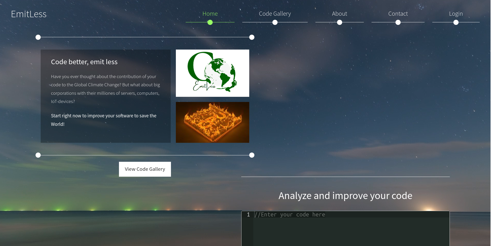

# EmitLess

*Code better, emit less*

> Have you ever thought about the contribution of your code to the Global Climate Change? But what about big corporations with their milliones of servers, computers, IoT-devices?

EmitLess — project designed to raise awareness about CO2 emissions caused by not optimized code and familiarize with green-coding paradigms on real-life examples.

## Idea

Electricity is a proxy of CO2 emissions. [Less electricity we consume, less CO2 we emit](https://sustainability.stackexchange.com/questions/9891/how-would-you-calculate-carbon-emissions-of-software). Meanwhile, According to the [processor power distribution](https://en.wikipedia.org/wiki/Processor_power_dissipation), less CPU clocks we consume, less electricity we consume. Thus, the main logic of application is to optimize code in such way that less number of CPU clocks cycles of the code.

## Code analyzer

Code analyzer — tool that can not only provide a suggestion how code can be improved but also directly correct it. In future, it is planned to built on top of AI.

## Code library

A collection of code snippets that with suggestions how to write more green and environmentally friendly code. The purpose of the library is to provide advice how diminish the possible carbon footprint of code. Moreover, it is used for training our AI. Of course, it is open for contributions.

## Rewards program

Are you a team lead of developers team who are also aware of CO2 emissions cause by modern technologies? You can also encourage your team to reduce the contribution of CO2 by your project codes. Just manage your team via EmitLess web-app and give small rewards for developers who really carry about C02 emissions. You can easily control how much CO2 was saved by each employee after optimization through the app.